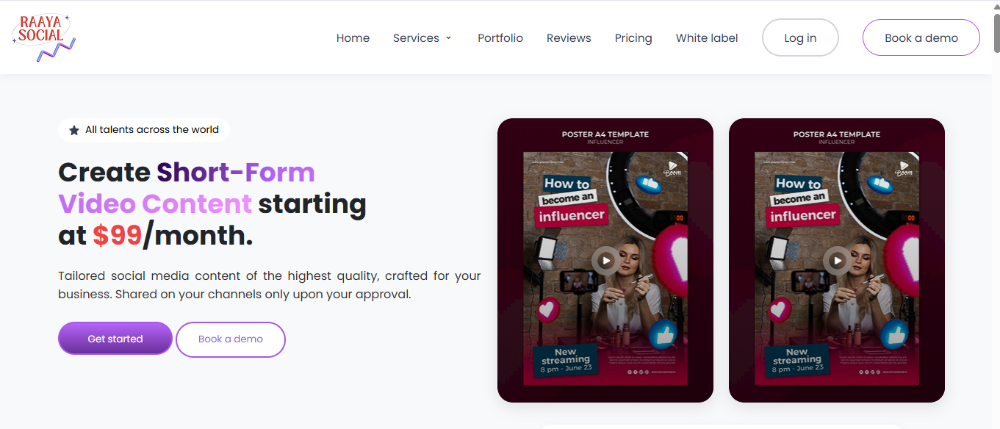

# Raaya Social - Short-Form Video Service Landing Page

This project is a responsive landing page for "Raaya Social" (or a similar service), designed to showcase their offerings in creating engaging short-form video content from raw footage for businesses and personal brands. The page highlights services, features, client stories, pricing, FAQs, and provides contact methods.



## Features

*   **Responsive Design:** Adapts layout for Desktop, Laptop, Tablet, and Mobile devices.
*   **Hero Section:** Clear value proposition, highlighted features, and visually engaging poster previews.
*   **Client Logo Showcase:** Displays logos of featured clients.
*   **All-Inclusive Services Section:** Details service features and presents selectable pricing plans.
*   **"Engaging Clip" Showcase:** Explains the transformation process using informative cards.
*   **Video Category Showcase:** Displays different video types (Business, Personal Brands) with horizontal scrolling thumbnails.
*   **Informational Section:** Explains the popularity and benefits of short-form video.
*   **Client Stories/Testimonials:** Features video thumbnails and quote cards from satisfied partners.
*   **FAQ Section:** Interactive accordion to answer common questions.
*   **Login Modal:** Popup form for user login (triggered by header button).
*   **Footer:** Contains navigation links, contact form, and copyright information with a dynamically updated year.
*   **Mobile Navigation:** Basic toggle functionality prepared (requires CSS for visual states).

## Technologies Used

*   **HTML5:** Semantic structure for content.
*   **CSS3:** Styling, layout (Flexbox, Grid), animations, and responsiveness (Media Queries).
    *   CSS Variables for maintainability.
*   **JavaScript (Vanilla):**
    *   FAQ Accordion interaction.
    *   Mobile navigation menu toggle.
    *   Login Modal open/close functionality.
    *   Dynamic footer year update (using `new Date().getFullYear()`).
*   **RemixIcon:** Used for icons (dropdown arrow, mobile menu toggle, modal close). Included via CDN.
*   **Google Fonts:** Poppins and Raleway.

## Setup and Installation

This is a static frontend project. No build steps or server-side dependencies are required.

1.  **Clone or Download:** Get the project files onto your local machine.
    ```bash
    git clone [your-repository-url]
    cd [repository-directory]
    ```
    Or simply download the ZIP file and extract it.

2.  **Ensure Asset Folder:** Make sure you have the `assets` folder (or `images`, depending on your paths) in the root directory containing all necessary images and icons referenced in the HTML and CSS.

3.  **Open in Browser:** Simply open the `index.html` file in your preferred modern web browser (Chrome, Firefox, Safari, Edge, etc.).

    ```bash
    # On Mac
    open index.html

    # On Windows (using default browser)
    start index.html

    # On Linux
    xdg-open index.html
    ```

## File Structure (Simplified)
```plaintext
/
├── index.html
├── style.css
├── script.js
├── assets/
│   ├── images/
│   └── icons/
├── screenshot.png (optional)
├── .gitignore
└── README.md
```

## Usage

*   **View:** Open `index.html` in a browser.
*   **Responsiveness:** Resize the browser window to see the layout adapt. Use browser developer tools for device simulation.
*   **FAQ:** Click on any question in the FAQ section to expand/collapse the answer.
*   **Login:** Click the "Log in" button in the header navigation to open the login modal. Click the 'X' button, the overlay outside the modal, or press the Escape key to close it.
*   **Mobile Menu:** On smaller screens (typically < 768px or < 992px depending on final CSS), click the hamburger menu icon to toggle the mobile navigation links (requires corresponding CSS for `.nav-active` state).

## Contributing

Currently, contributions are not actively sought. However, feel free to fork the repository and experiment. If you find bugs or have suggestions, you can open an issue (if applicable).

## Author

*   **Atik Mazumdar** - [mazumdaratik](https://github.com/mazumdaratik) *(Initial work based on provided elements)*

---
